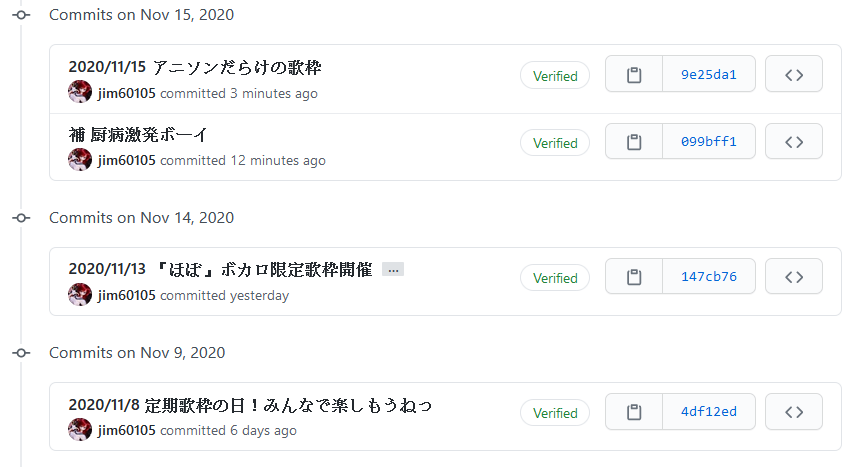
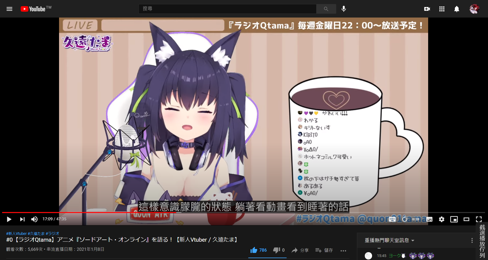

# Youtube 影片截選播放清單 (Youtube Clip Playlist)

 
 
 
 

## Youtube 網址格式

    https://www.youtube.com/watch?
    	v=ETjgki1sSgc &
    	t=1591 &
    	end=1880 &
    	shuffle=1 &
    	playlistinclude=quon &
    	playlistexclude=member

## Google Drive 網址格式

    https://drive.google.com/file/d/13LaALYNOmdN3GfD7aeKreyzshdKX-Tvz/view?
    	t=884 &
    	end=1166 &
    	shuffle=1 &
    	playlistinclude=quon &
    	playlistexclude=member

## 參數說明

-   VideoID: 在 Youtube 原生為`v`參數，在 Google Drive 是在路徑中
-   `t`: 影片播放開始時間
-   `end`: 設定在指定秒數停止播放影片
-   `shuffle`: Playlist 隨機播放
-   `playlistinclude`: 讀入 Playlist 標籤，可以以「_」底線分隔傳入多個標籤
-   `playlistexclude`: 排除 Playlist 標籤，可以以「_」底線分隔傳入多個標籤

## 功能

-   設定 end 後會**在指定秒數停止播放器**
-   end 功能並不依賴播放清單功能，**end 參數可以單獨傳入**
-   若傳入 playlistinclude，則**只會載入有該標籤的清單**
-   若傳入 playlistexclude，則會**排除有該標籤的清單**，Exclude 優先於 Include
-   播放清單自外鏈載入，方便更新和**自動更新**
-   若在播放清單中能找到和當前`VideoID`、`t`、`end`三個參數都相同之項目，則會進入播放清單功能 \
    (在播放完該曲後循序/隨機播放下一首歌)
-   隨機功能為建立亂序清單後播放，在**所有歌曲都放過後才會循環**
-   傳入 startplaylist 參數時會立刻重建亂序清單
-   GoogleDrive 影片無法在背景播放，若頁籤不是在前景，則會自動下一首

## 安裝步驟

1. 安裝瀏覧器擴充: [Tampermonkey](https://www.tampermonkey.net/)
2. 安裝腳本: [Youtube Clip Playlist](https://github.com/jim60105/YoutubeClipPlaylist/raw/master/YoutubeClipPlaylist.user.js)
3. 修改 Tampermonkey 設定，每次播放都重載歌單
    1. 一般 → 設定模式: 進階
    2. 外部 → 更新週期: **永遠**
4. 使用方式，請手動儲存以下啟動連結至書籤
    > 如果是使用 Firefox，需要關閉「阻擋媒體自動播放」功能，請參閱: \
    > https://support.mozilla.org/en-US/kb/block-autoplay

## 啟動連結範例

> 目前非歌曲的內容只有「RadioQTama廣播」，其它人其實是可以省略NotSongs排除

| 說明               | 連結                                                                                           |
| ------------------ | ---------------------------------------------------------------------------------------------- |
| 全清單循序         | https://www.youtube.com/?startplaylist                                                         |
| 全清單隨機         | https://www.youtube.com/?startplaylist&shuffle=1                                               |
| 久遠たま全歌單循序 | https://www.youtube.com/?startplaylist&playlistinclude=tama&playlistexclude=NotSongs           |
|久遠たま歌單(排除會限)|https://www.youtube.com/?startplaylist&playlistinclude=tama&playlistexclude=member_NotSongs|
| 久遠たま全歌單隨機 | https://www.youtube.com/?startplaylist&playlistinclude=tama&playlistexclude=NotSongs&shuffle=1 |
| RadioQTama 廣播    | https://www.youtube.com/?startplaylist&playlistinclude=RadioQTama                              |
| 伊冬ユナ全歌單循序 | https://www.youtube.com/?startplaylist&playlistinclude=ItouYuna&playlistexclude=NotSongs           |
| 伊冬ユナ全歌單隨機 | https://www.youtube.com/?startplaylist&playlistinclude=ItouYuna&playlistexclude=NotSongs&shuffle=1 |
| 羽宮くぅ全歌單循序 | https://www.youtube.com/?startplaylist&playlistinclude=HaneMiya&playlistexclude=NotSongs           |
| 羽宮くぅ全歌單隨機 | https://www.youtube.com/?startplaylist&playlistinclude=HaneMiya&playlistexclude=NotSongs&shuffle=1 |

## 歌單

目前內建的是久遠たま、伊冬ユナ、羽宮くぅ的歌單\
伊冬ユナ和羽宮くぅ的歌單由[小飯](https://twitter.com/LittleRice1007)維護\
如果願意參與，請參考[此repo](https://github.com/jim60105/Playlists)的合作模式 

### 建立

歌單的格式是JSON with comment，建立請參考[這裡](https://github.com/jim60105/Playlists/blob/master/QuonTama/QuonTamaSongList.jsonc)\
在[這裡](https://github.com/jim60105/Playlists/blob/master/Playlists.jsonc)有總表，標示清單名稱和標籤\
"maintainer"目前沒有實作功能 

Array 中儲存項目: [VideoID, StartTime, EndTime, Title?, SubSrc?]

-   VideoID: 必須用引號包住，為字串型態
-   StartTime: 必須是非負數，為數字型態。如果要從頭播放，輸入 0
-   EndTime: 必須是非負數，為數字型態。如果要播放至尾，輸入 0
-   Title?: 必須用引號包住，為字串型態，可選
-   SubSrc?: 必須用引號包住，為字串型態，可選

### 更新

請按照安裝步驟 3 調整設定，啟用自動重載功能\
每次播放都會由連結重載歌單，建議把歌單用 Github 管理\
如此只要更新了歌單文檔，git push 上去就能完成推送

## 字幕

此工具支援載入WebVTT字幕(.vtt)、ASS字幕(.ass)，請將字幕直鏈傳入歌單之SubSrc

