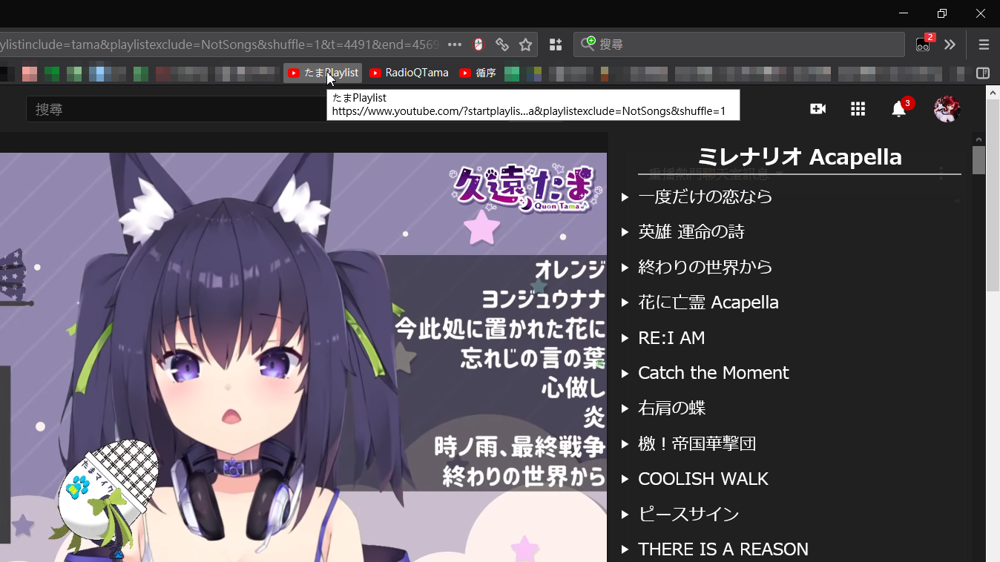
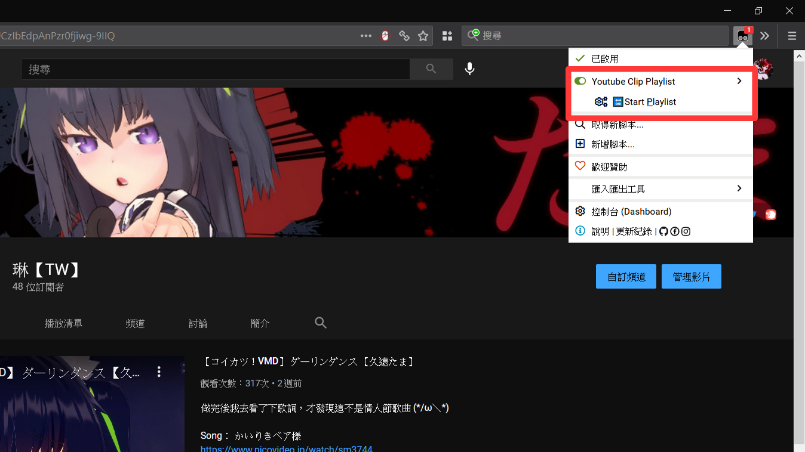
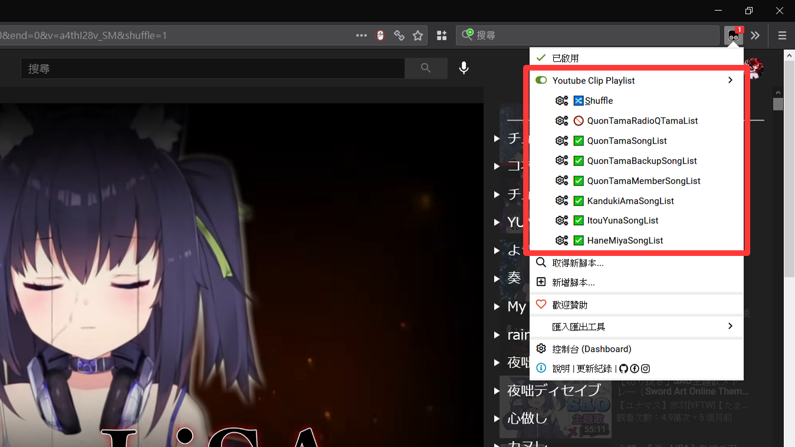

# Youtube 影片截選播放清單 (Youtube Clip Playlist)

## 安裝步驟

> 如果是使用 Firefox，需要關閉「阻擋媒體自動播放」功能，請參閱: \
> <https://support.mozilla.org/en-US/kb/block-autoplay>

1. 安裝瀏覧器擴充: [Tampermonkey](https://www.tampermonkey.net/)
1. 安裝腳本: [Youtube Clip Playlist](https://github.com/jim60105/YoutubeClipPlaylist/raw/master/YoutubeClipPlaylist.user.js)
1. 修改 Tampermonkey 設定，每次播放都重載歌單
    1. 一般 → 設定模式: 進階
    2. 外部 → 更新週期: **永遠**
1. 播放 Playlist
    1. [由網址啟動](#啟動連結)
    2. [由啟動 UI 啟動](#啟動UI)

## Youtube 網址格式

    https://www.youtube.com/watch?
     v=ETjgki1sSgc &
     t=1591 &
     end=1880 &
     shuffle=1 &
     playlistinclude=quon &
     playlistexclude=member

## Google Drive 網址格式

    https://drive.google.com/file/d/13LaALYNOmdN3GfD7aeKreyzshdKX-Tvz/view?
     t=884 &
     end=1166 &
     shuffle=1 &
     playlistinclude=quon &
     playlistexclude=member

## 其它網址格式 (目前支援 OneDrive、twitcasting)

其它格式是以原網址直接當做 VideoID 傳入

    https://twitcasting.tv/quon01tama/movie/688324697
     t=1470 &
     end=1653 &
     shuffle=1 &
     playlistinclude=twitcasting

## 參數

-   VideoID: 在 Youtube 原生為`v`參數；Google Drive 是在路徑中；其它為原始網址
-   `t`: 影片播放開始時間
-   `end`: 設定在指定秒數停止播放影片
-   `shuffle`: Playlist 隨機播放，1 為啟用；0 為禁用(等同不傳入)
-   `playlistinclude`: 讀入 Playlist 標籤，可以以「\_」底線分隔傳入多個標籤
-   `playlistexclude`: 排除 Playlist 標籤，可以以「\_」底線分隔傳入多個標籤

## 詳細功能描述

-   設定 end 後，能**在指定秒數停止播放器**
-   若傳入 playlistinclude，則**只會載入有該標籤的清單**
-   若傳入 playlistexclude，則會**排除有該標籤的清單**，且 Exclude 優先於 Include
-   隨機功能為建立亂序清單後播放，在**所有歌曲都放過一輪後才會再循環**
-   傳入 startplaylist 參數時會立刻重建亂序清單
-   支援以**鍵盤的媒體按鍵(Media Keys)操作「下一首」**
-   **遮蔽「影片已暫停，要繼續觀賞嗎？」功能**

## 啟動連結

> 目前非歌曲的內容只有「RadioQTama 廣播」，其它人可以省略 NotSongs 排除

| 說明                      | 連結                                                                                             |
| ------------------------- | ------------------------------------------------------------------------------------------------ |
| 全清單 循序               | <https://www.youtube.com/?startplaylist>                                                         |
| 全清單 隨機               | <https://www.youtube.com/?startplaylist&shuffle=1>                                               |
| 久遠たま全歌單循序        | <https://www.youtube.com/?startplaylist&playlistinclude=tama&playlistexclude=NotSongs>           |
| 久遠たま歌單(排除會限)    | <https://www.youtube.com/?startplaylist&playlistinclude=tama&playlistexclude=member_NotSongs>    |
| 久遠たま全歌單隨機        | <https://www.youtube.com/?startplaylist&playlistinclude=tama&playlistexclude=NotSongs&shuffle=1> |
| 久遠たま twitcasting 歌單 | <https://www.youtube.com/?startplaylist&playlistinclude=twitcasting>                             |
| RadioQTama 廣播           | <https://www.youtube.com/?startplaylist&playlistinclude=RadioQTama>                              |
| 須多夜花全歌單循序        | <https://www.youtube.com/?startplaylist&playlistinclude=yoruka>                                  |
| 須多夜花全歌單隨機        | <https://www.youtube.com/?startplaylist&playlistinclude=yoruka&shuffle=1>                        |
| 間取かける歌單循序        | <https://www.youtube.com/?startplaylist&playlistinclude=kakeru>                                  |
| 間取かける歌單隨機        | <https://www.youtube.com/?startplaylist&playlistinclude=kakeru&shuffle=1>                        |
| 伊冬ユナ全歌單循序        | <https://www.youtube.com/?startplaylist&playlistinclude=ItouYuna>                                |
| 伊冬ユナ全歌單隨機        | <https://www.youtube.com/?startplaylist&playlistinclude=ItouYuna&shuffle=1>                      |
| 羽宮くぅ全歌單循序        | <https://www.youtube.com/?startplaylist&playlistinclude=HaneMiya>                                |
| 羽宮くぅ全歌單隨機        | <https://www.youtube.com/?startplaylist&playlistinclude=HaneMiya&shuffle=1>                      |
| 町田ちま全歌單循序        | <https://www.youtube.com/?startplaylist&playlistinclude=MachitaChima>                            |
| 町田ちま全歌單隨機        | <https://www.youtube.com/?startplaylist&playlistinclude=MachitaChima&shuffle=1>                  |
| 牧野白全歌單循序          | <https://www.youtube.com/?startplaylist&playlistinclude=MakinoShiro>                             |
| 牧野白全歌單隨機          | <https://www.youtube.com/?startplaylist&playlistinclude=MakinoShiro&shuffle=1>                   |

## TamperMonkey UI 選單

### 啟動 UI

在 Youtube 網站下點開 TamperMonkey 選單，單擊「Start Playlist」 \
這相當於 **啟動連結—全清單循序 (<https://www.youtube.com/?startplaylist>)** \

### 禁用歌單功能

在個別播放清單上單擊可以啟用、禁用該播放清單 \
_若你完全不聽廣播，可以把 RadioQTamaList 禁用，再使用全循序/隨機播放功能_ \

## 歌單(Playlist)

目前內建的是**久遠たま、須多夜花、伊冬ユナ、羽宮くぅ**的歌單\
久遠たま、須多夜花的歌單由[琳](https://twitter.com/jim60105)維護；伊冬ユナ和羽宮くぅ的歌單由[小飯](https://twitter.com/LittleRice1007)維護\
如果想要參與編寫，請參考[此 repo](https://github.com/jim60105/Playlists)的合作模式

### 歌單格式

歌單的格式是 JSON with comment \
在這裡有[總表](https://github.com/jim60105/Playlists/blob/master/Playlists.jsonc)，標示清單名稱、標籤、位置，並載入[個別歌單](https://github.com/jim60105/Playlists/blob/master/QuonTama/QuonTamaSongList.jsonc)

每個陣列中儲存以下項目: [VideoID, StartTime, EndTime, Title?, SubSrc?]

-   VideoID: 必須用引號包住，為字串型態
-   StartTime: 必須是非負數，為數字型態。如果要從頭播放，輸入 0
-   EndTime: 必須是非負數，為數字型態。如果要播放至尾，輸入 0
-   Title?: 必須用雙引號包住，為字串型態，可選
-   SubSrc?: 必須用雙引號包住，為字串型態，可選

## 字幕

此工具支援載入 WebVTT 字幕(.vtt)、ASS 字幕(.ass)，請將字幕直鏈傳入歌單之 SubSrc 欄位

> 我在[RadioQTama 播放清單](https://www.youtube.com/?startplaylist&playlistinclude=RadioQTama)中使用了來自[アルバート](https://twitter.com/alubto)的翻譯字幕，是直接由[他的 repo](https://gitlab.com/alubaato/tama-subs)取得內容\
> 我使用了一支[.Net Core 程式](https://github.com/jim60105/Playlists/blob/master/QuonTama/CreateRadioQTamaSubtitles/CreateRadioQTamaSubtitles/Program.cs)和[Github Workflow](https://github.com/jim60105/Playlists/blob/master/.github/workflows/CreateRadioQTamaSubtitles.yml)做 CI\
> 定時由他的 gitlab 取得 ass 直鏈，並重寫歌單；自動 Commit、PR、Merge

