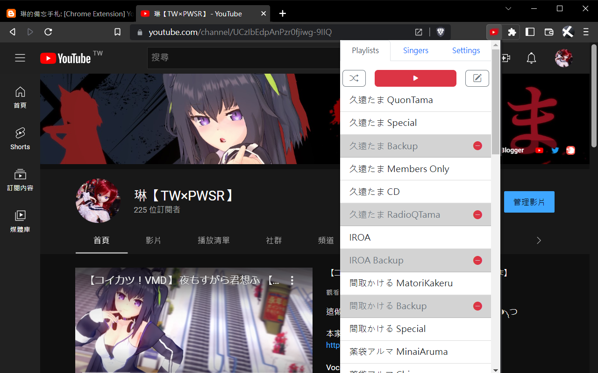

#  Youtube 影片截選播放清單 (Youtube Clip Playlist)

  
    
   
    
  

> **Warning**  
> Youtube launch a new feature called ["Clips"](https://support.google.com/youtube/answer/10332730) and this tool has ***ABSOLUTELY NOTHING*** to do with it.  
> This tool existed long before this feature was introduced.

## 這是?

這是截選播放清單功能，在 Youtube/GoogleDrive/TwitCasting 上直接播放「起始~結束時間」影片片段。  
此工具專門設計來聽 Vtuber 的歌枠。

和烤肉或剪片相比的優點為

- 觀看數都會算在原始影片上
- 只要清單化起始/結束時間就完事，比剪片快得多
- 因為沒有轉載、修改原影片，不會有版權爭議

## 安裝步驟

1. 參照[這篇文章](https://blog.maki0419.com/2022/01/media-autoplay-on-browser.html)，設定下方網域的**允許自動播放**

    - `https://www.youtube.com:443`
    - `https://twitcasting.tv:443`
    - `https://drive.google.com:443`

1. 安裝瀏覧器擴充功能: [Chrome Web Store](https://chrome.google.com/webstore/detail/kdlhjpdoaabhpolkaghkjklfcdfjapkh)

## 彈窗 UI 選單

### UI

瀏覧器右上角開啟擴充工具彈出式視窗

- 單擊左上角的隨機按鈕，切換是否隨機播放
- 單擊中間的紅色播放按鈕，播放**所有**播放清單
- 單擊播放清單列表，播放**單一**播放清單

### 禁用歌單功能

> _例: 若是不聽廣播，可以把 RadioQTamaList 禁用，再使用全循序/隨機播放功能_

點擊右上角進入「編輯」功能，此時在清單項單擊可以啟用、禁用該播放清單  
編輯完成後，請務必單擊右上角「儲存」按鈕寫入設定

## 歌單(Playlist)

目前內建歌單內容如下  
**久遠たま、須多夜花、薬袋アルマ、浠Mizuki、神月天、町田ちま、YOSHIKA⁂Ch.、炭酸ちゃん、名雪薇薇、紅記えり、苺咲べりぃ、HACHI、獅子神レオナ、松永依織、石狩あかり、凛々咲 Ririsya、牧野白、火閻まどか、鈴花ステラ、羽宮くぅ、苓吃エムリィ、伊冬ユナ、間取かける**

如果想要編寫歌單，請參考[此 repo](https://github.com/YoutubeClipPlaylist/Playlists)  
你也可以fork此repo，從頭寫你自己的！

### 歌單格式

歌單的格式是 JSON with comment  
在這裡有[總表](https://github.com/YoutubeClipPlaylist/Playlists/blob/master/Playlists.jsonc)，標示清單名稱、標籤、位置，並載入[個別歌單](https://github.com/YoutubeClipPlaylist/Playlists/blob/master/QuonTama/QuonTamaSongList.jsonc)

每個陣列中儲存以下項目: [VideoID, StartTime, EndTime, Title?, SubSrc?]

- VideoID: 必須用雙引號包住，為字串型態
- StartTime: 必須是非負數，為數字型態。如果要從頭播放，輸入 0
- EndTime: 必須是非負數，為數字型態。如果要播放至尾，輸入 0
- Title?: 必須用雙引號包住，為字串型態，可選
- SubSrc?: 必須用雙引號包住，為字串型態，可選

## 歌詞、字幕

### 自動歌詞功能

此專案有一支排程程式，自動從網路上蒐集歌詞，請在 UI 的 Settings 頁啟用。  
歌詞來源為 [網易雲音樂](https://music.163.com/)，以 Github Workflow 定時將播放清單使用的歌詞[轉存至 Github](https://github.com/YoutubeClipPlaylist/Lyrics/tree/lyrics)，然後再讓客戶端存取 Github。  
經過這層轉存，你不會直接存取網易雲音樂站台，請安心使用。

>注意，這是附加功能！  
>由於歌詞皆為自動化搜尋匹配，能預期會有大量的錯誤情況發生。  
>若發現歌詞有錯誤，請在[這裡](https://github.com/YoutubeClipPlaylist/Lyrics/issues/new/choose)回報。  
>請務必提供該歌曲的 Share 連結，以便我能夠快速修正錯誤歌曲

  
↓啟用後↓  

### ASS字幕功能

此工具支援載入WebVTT字幕(.vtt)、ASS字幕(.ass)、lrc歌詞(.lrc)，可將字幕直鏈傳入歌單之SubSrc欄位

## 讀取的網址參數

- VideoID: 在 Youtube 原生為`v`參數；Google Drive 是在路徑中；其它為原始網址
- `t`: 影片播放開始時間
- `end`: 設定在指定秒數停止播放影片
- `shuffle`: Playlist 隨機播放，1 為啟用；0 為禁用(等同不傳入)
- `playlist`: 播放單一清單，不能和 `playlistinclude`、`playlistexclude` 同時傳入
- `playlistinclude`: 讀入 Playlist 標籤，可以以「\_」底線分隔傳入多個標籤，不能和 `playlist` 同時傳入
- `playlistexclude`: 排除 Playlist 標籤，可以以「\_」底線分隔傳入多個標籤，不能和 `playlist` 同時傳入

## 詳細功能描述

- 此工具是由網址參數驅動
- 傳入`startplaylist`時會啟動此工具，執行**全清單循序播放**
- 傳入`end`，會**在指定秒數停止播放器**
- 傳入`playlist`參數，會播放指定播放清單
- 使用「標籤篩選功能」，可以混合播放多個播放清單 (例如，以`playlistinclude=tama`播放久遠たま的所有類型播放清單)
  - 傳入`playlistinclude`，將**只會載入有該標籤的清單**
  - 傳入`playlistexclude`，則會**排除有該標籤的清單**
- 「禁用歌單功能」將禁用指定歌單，即使透過標籤篩選也會被排除在外
- 「隨機功能」為建立亂序清單後播放，在所有歌曲都放過一輪後才會再循環
- 支援以**鍵盤的媒體按鍵(Media Keys)操作「下一首」**
<!-- - **遮蔽「影片已暫停，要繼續觀賞嗎？」功能** -->

## LICENSE

  

[GNU GENERAL PUBLIC LICENSE Version 3](LICENSE)

This program is free software: you can redistribute it and/or modify it under the terms of the GNU General Public License as published by the Free Software Foundation, either version 3 of the License, or (at your option) any later version.

This program is distributed in the hope that it will be useful, but WITHOUT ANY WARRANTY; without even the implied warranty of MERCHANTABILITY or FITNESS FOR A PARTICULAR PURPOSE. See the GNU General Public License for more details.

You should have received a copy of the GNU General Public License along with this program. If not, see <https://www.gnu.org/licenses/>.
